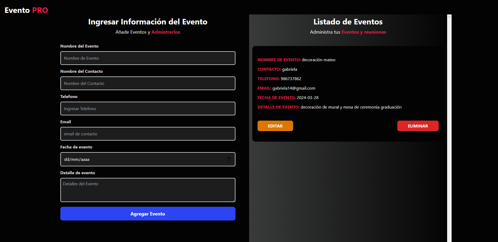
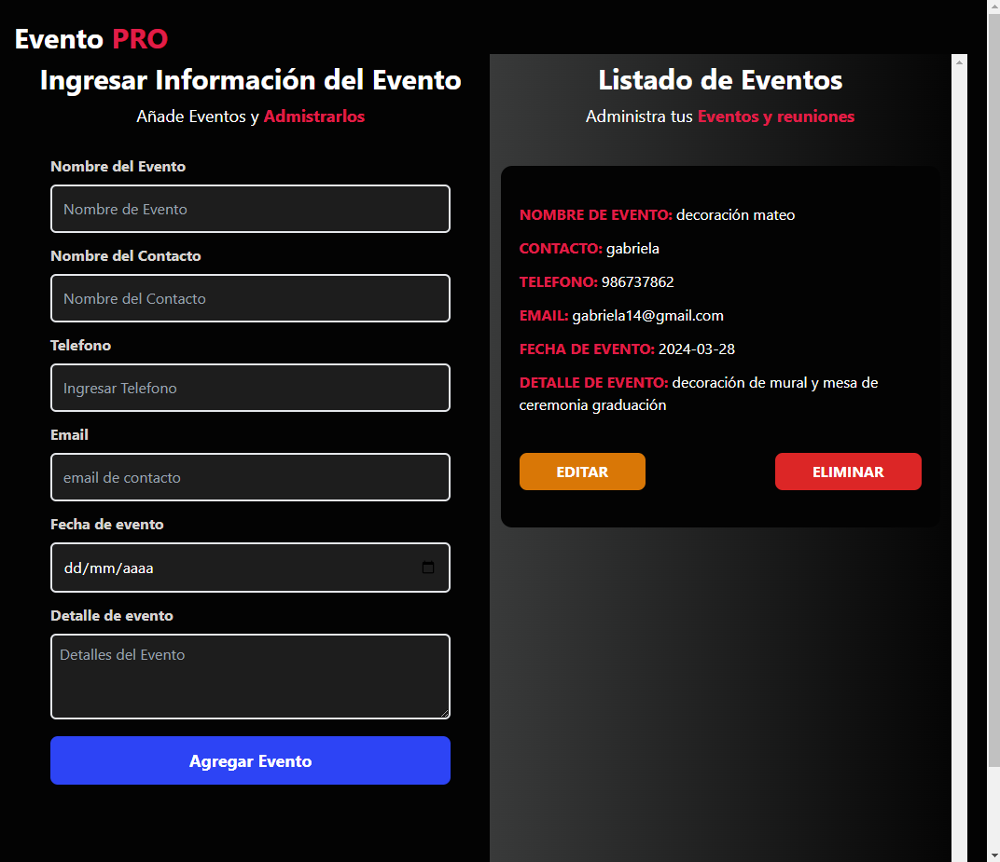
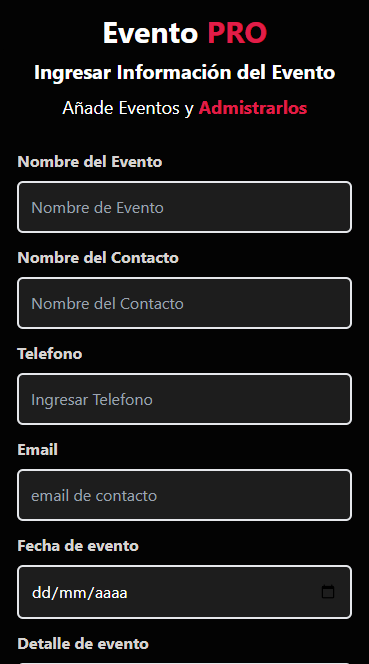

# PROYECTO EVENTO PRO (React + Vite)
---
**Realizado: Jorge Luis Monzón Morales**

El siguiente proyecto consiste en un administrador y organizador de cualquier tipo de evento ya sea personal o grupal se trabajo con React mediante Hooks como useState, useEffec, se utilizo componentes funcionales y la interacción mediante props y estados, ademas se utilizo localStorage como almacenamiento:

Tecnologias aplicadas:
- HTML
- CSS
- REACT JS
- Tailwind CSS
- Vite

**Modo Escritorio**
---

**Modo Tablet**
---

**Modo celular**
---

**Realizado: Jorge Luis Monzón Morales**

